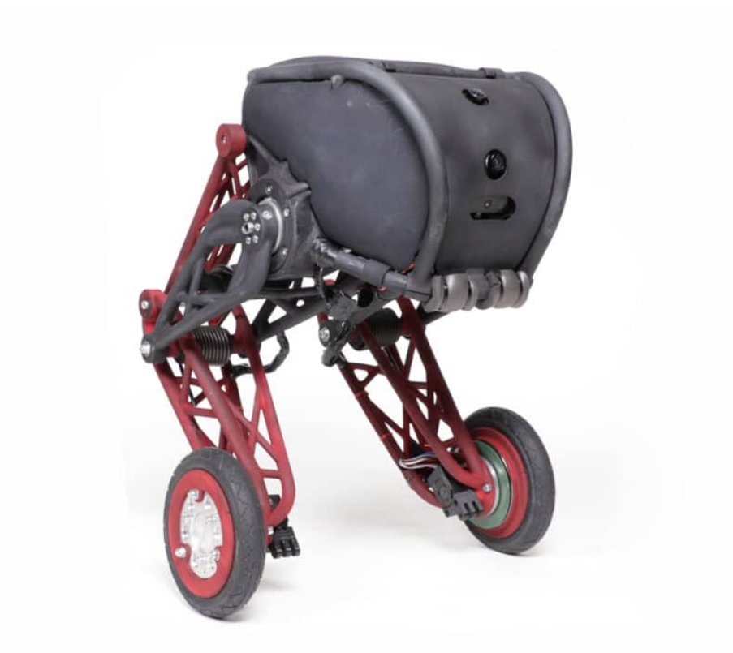
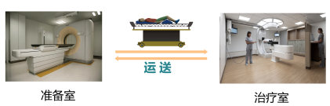
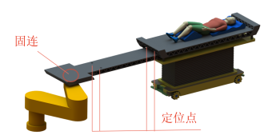

# Robot_WHU_2021

> This package is used to describe the robot competition for WHU design and manufacturing class 2021. In this class,we will set up two different scenarios for robot competition. The detailed describitipn are given below:

## 1. 二轮平衡小车

### 1.1 题目描述

​	设计一个两轮自平衡小车——利用控制理论和传感器融合技术(Feedback control system, PID, Kalman Filters, etc.)来让两轮小车保持直立。

### 1.2 题目内容

- 两轮自平衡小车的结构设计；

- 在一定时间内实现稳定状态（暂定为10s内）；

- 达到稳定后，小车的位置摆动不得超过一定长度（暂定为0.05m）；

- 记录下调试过程（PID parameter, estimate robot parameter, evaluate of balancing performance, even the debugging tricks...)；

- 所有的代码和报告均发布在GitHub上；

### 1.3 评分标准

根据完成情况、现场演示的表现和提交的报告来评价。

## 2. 质子治疗床板转接方案设计

### 2.1 题目描述

​	本题目基于质子治疗转运技术，传统的质子治疗流程为单式串行，质子利用率低，成本高。为提升治疗效率，采用多个准备室服务单一治疗室的方案,由AGV完成对人的运送，并通过设计实现床板在AGV和机械臂之间的转接。

### 2.2 题目内容

- 设计转接方案——实现治疗床在AGV和机械臂之间的转接；

- 转接过程中需完成：误差补偿（误差范围之后将给出）；

- 机械臂将治疗床从AGV上取下并放回；具有肉眼可见的稳定性，无振动和强碰撞。学生只需做AGV以上的部分（机械臂不用），机械臂的运动轨迹会提供给大家。

### 2.3 评分标准

根据完成度，稳定性，外观等来评价。

